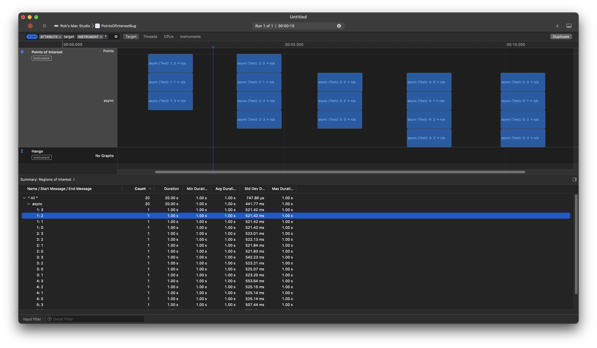

#  Points of Interest Bug

In Xcode 15.0.1 – 15A507 (and, also in previous version, 15.0 – 15A240d), I have noticed that Points of Interest intervals do not always show up. E.g., I profiled the attached app and every click of a button should log four intervals, but sometimes only three show up:

Also interesting, when this problem manifests itself, that lane seems to be “out of commission” and it stops putting anything else on this lane, and starts a new lane. This does not jump out at you when you do only five iterations, but becomes quite apparent when you repeat this hundreds of times.

Curiously, the intervals show up in the “Detail” area of Instruments (where you can see “Summary: Regions of Interest” and “List: Regions of Interest”), just not in the lanes of the main panel.

I have noticed this on simulators, macOS targets (both macOS 13.6 and 14.0), and physical device targets (both iOS 14.1 and iOS 17.0).

In one case, I actually saw an artifact of the missing interval (just the leading edge, with wrong start/end messages when I hovered my mouse over it), but I have not been able to reproduce that problem. Generally the missing interval just does not show up.

Unrelated, but in my custom `os-signpost-interval-schema` instruments, I have not seen this problem. I have only noticed it with the standard “Points of Interest” tool.

What I have noticed is that the problem is manifested when starting multiple tasks at the same time. To me, that screams “race”, so I tried adding some synchronization around the “create signpost id and start interval”, and the problem went away. Interesting data point.

Note, I have saved the `.trace` file/bundle/folder from the above screen snapshot in case that helps you diagnose what’s going on. See [PointsOfInterestLog.trace](PointsOfInterestLog.trace).
